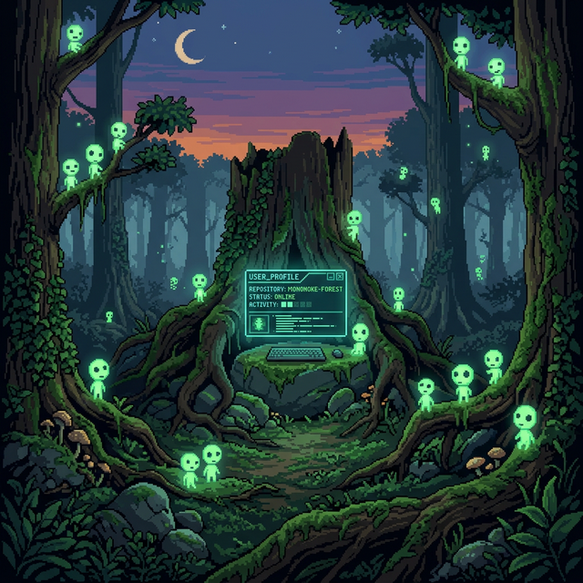

  

<h3 align="center">Computer Science Master's Student | Artificial Intelligence & Bioinformatics</h3>

---

### The Path So Far

I'm currently finalizing my Master's Degree in Computer Science, focusing on academic research and work projects. My passion lies at the intersection of advanced computational models and biological complexity. Using **AI techniques** to uncover hidden patterns within **Bioinformatics** and data, turning raw information into meaningful insights.

---

  **Languages** 
  
  
  
  
  
  
  
  

  **AI, Data & Analytics** 
  
  
  
  
  
  

  **Frameworks, Tools & Infrastructure** 
  
  
  
  
  
  
  

---

### Selected Works

| Project | Description | Tech/Language |
|:---|:---|:---:|
| 🧠 **[ml-project](https://github.com/mononoke2/ml-project)** | *People Detection & Counting using YOLO and Faster R-CNN (ResNet50).* | `TeX` / `ML` |
| 🧬 **[data-mining-project](https://github.com/mononoke2/data-mining-project)** | *Classifier for Breast Cancer (BC) subtypes and stages.* | `Data Mining` |
| 🧫 **[bioinformatics-project](https://github.com/mononoke2/bioinformatics-project)** | *Exploring and uncovering patterns in biological data using AI.* | `AI` / `Bioinformatics`|
| 🔍 **[ia-project](https://github.com/mononoke2/ia-project)** | *Tabu Search Algorithm solving the Weighted Feedback Vertex Set Problem.* | `TeX` / `AI`|
| 📊 **[fondamenti-analisi-dati-project](https://github.com/mononoke2/fondamenti-analisi-dati-project)** | *Data correlations on socio-cultural statistics (police violence & minorities).* | `Jupyter Notebook`|
| 🎮 **[smm-project](https://github.com/mononoke2/smm-project)** | *Steam API Profiling & Recommendations System tutorial.* | `HTML` / `RecSys`|

 

  
<b>🌱 See more projects...</b>

  <ul>
    <li><b><a href="https://github.com/mononoke2/mms-project">mms-project</a></b>: Ehrenfest's physical model on the second law of thermodynamics (Processing GUI).</li>
    <li><b><a href="https://github.com/mononoke2/GPT-and-BERT-classification">GPT-and-BERT-classification</a></b>: NLP classification tasks.</li>
  </ul>

---